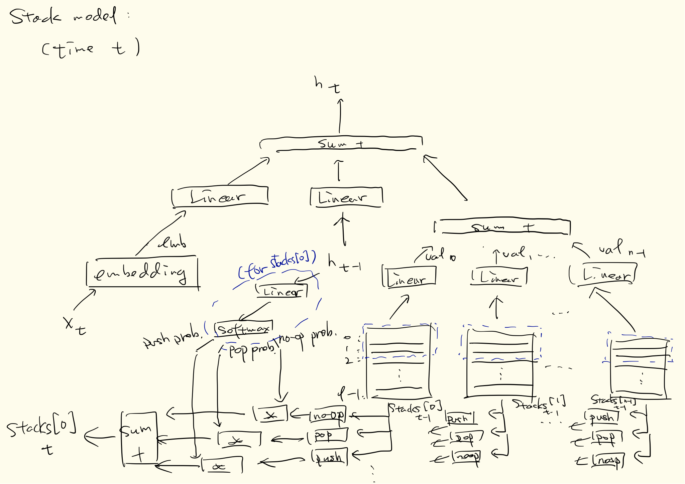
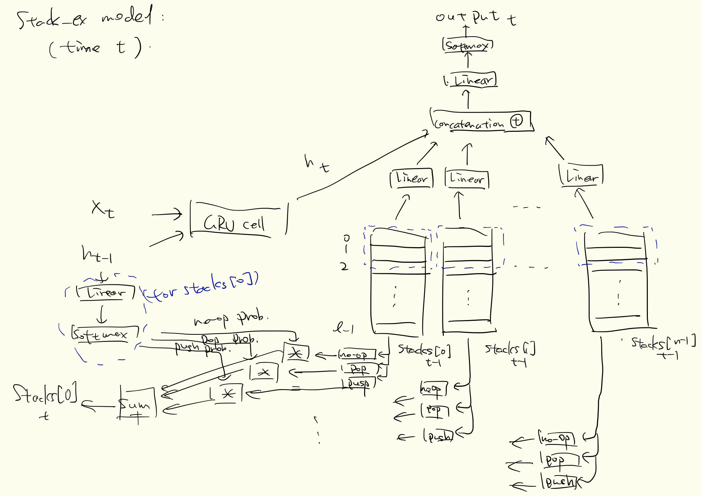

# Seq2seq stack RNN

### 目录结构

```bash
srnn/
├── README.md #本文件
├── crash_on_ipy.py #调试debug
├── d #从服务器结点下载训练好模型到本地
├── data #存放训练、测试数据
│   ├── aa-bb.test #人工测试数据，模式为'a a a \t a a a'，输入长度为6-16
│   ├── aa-bb.txt #人工训练数据，模式为'a a a \t a a a'，输入长度为1-10
│   ├── en-zh.txt #中英翻译训练数据
│   └── spa-en.txt #西英翻译训练数据
├── data.py #预处理数据
├── eval.py #评估方法 
├── gru.py #gru模型
├── log #存放log数据，格式为'log_[时间]_[tag].txt'，其中tag为命令行参数
├── main.py #训练测试，每0.01*EPOCHS测试一次
├── output #存放模型参数
├── params.py #超参数，命令行参数
├── print.py #生成人工数据
├── stack.py #simple RNN+stack（内置）模型
├── stack_ex.py #GRU+stack（外置）模型
└── v #从服务器结点下载log
```

### 依赖环境

python 3.6.4

Pytorch 0.4

### 运行

#### 运行示例：

```bash
cd srnn
python main.py -epochs 1000 -gpu 0
```

#### 命令行参数：

```bash
optional arguments:
  -h, --help            show this help message and exit
  -epochs EPOCHS        number of epochs for train
  -batch_size BATCH_SIZE
                        number of epochs for train
  -lr LR                initial learning rate
  -grad_clip GRAD_CLIP  initial learning rate
  -max_length MAX_LENGTH
                        maximum sequence length
  -output OUTPUT        output directory for model saving
  -log LOG              log file directory
  -hidden HIDDEN        dimension of hidden states
  -stack_size STACK_SIZE
                        stack size
  -stack_elem_size STACK_ELEM_SIZE
                        dimension of each stack element
  -nstack NSTACK        how many stacks to use
  -stack_depth STACK_DEPTH
                        how many stack element to use for predicting
  -gpu GPU              gpu index(if could be used)
  -use_stack USE_STACK  whether to use stack
  -teaching TEACHING    teacher forcing ratio
  -tag TAG              tags to print into the log
  -mode MODE            train or test
  -add_pad ADD_PAD      whether add one additional <PAD> for each source
                        sentence
  -model MODEL          stack_ex, stack or gru
  -train_file TRAIN_FILE
                        file for training, file name format: [source
                        name]-[target name].txt
  -test_file TEST_FILE  file for testing, file name format: [source
                        name]-[target name].test
```

```python
p.add_argument('-epochs', type=int, default=30,
                   help='number of epochs for train')
    p.add_argument('-batch_size', type=int, default=32,
                   help='number of epochs for train')
    p.add_argument('-lr', type=float, default=0.0001,
                   help='initial learning rate')
    p.add_argument('-grad_clip', type=float, default=10.0,
                   help='initial learning rate')
    p.add_argument('-max_length', type=int, default=50,
                   help='maximum sequence length')
    p.add_argument('-output', type=str, default='output',
                   help='output directory for model saving')
    p.add_argument('-log', type=str, default='log',
                   help='log file directory')
    p.add_argument('-hidden', type=int, default=256,
                   help='dimension of hidden states')
    p.add_argument('-stack_size', type=int, default=10,
                   help='stack size')
    p.add_argument('-stack_elem_size', type=int, default=256,
                   help='dimension of each stack element')
    p.add_argument('-nstack', type=int, default=2,
                   help='how many stacks to use')
    p.add_argument('-stack_depth', type=int, default=2,
                   help='how many stack element to use for predicting')
    p.add_argument('-gpu',type=int,default=0,
                   help='gpu index(if could be used)')
    p.add_argument('-use_stack',type=bool, default=True,
                   help='whether to use stack')
    p.add_argument('-teaching', type=float, default=0.5,
                   help='teacher forcing ratio')
    p.add_argument('-tag', type=str, default='stack',
                   help='tags to print into the log')
    p.add_argument('-mode', type=str, default='train',
                   help='train or test')
    p.add_argument('-add_pad',type=bool, default=False,
                   help='whether add one additional <PAD> for each source sentence')
    p.add_argument('-model', type=str, default='stack_ex',
                   help='stack_ex, stack or gru')
    p.add_argument('-train_file', type=str, default='aa-bb',
                   help='file for training, file name format: [source name]-[target name].txt')
    p.add_argument('-test_file', type=str, default='aa-bb',
                   help='file for testing, file name format: [source name]-[target name].test')
```

### 结果

#### 命令：

```bash
python main.py -epochs 1000 -batch_size 32 -model stack_ex -tag stack_ex
```

#### Log:

(这里仅显示部分结果)

每个epoch的每个子阶段结束会随机选择一个训练样本进行测试，

'>'、'='、'<'分别指示输入、标注、预测。

这里EPOCHS=1000，每1000*0.01=10 epoch测试一次，这里第19 epoch后测试结果为准确率约为0.38。

```bash
#log_1525592478714675_stack_ex.txt:
epoch 19 | percent 0.741935 | loss 0.064604 | interval 0.682815 s
> t t t t t t
= t t t t t t
< t t t t t t t t

epoch 19 | percent 0.838710 | loss 0.049899 | interval 0.685964 s
> b b b b
= b b b b
< b b b b b

epoch 19 | percent 0.935484 | loss 0.080650 | interval 0.716509 s
> p p p p
= p p p p
< p p p p

end of epoch 19 | time: 7.152071 s | loss: 0.045196
accuracy in testing:  0.38205645161290325
epoch 20 | percent 0.064516 | loss 0.074663 | interval 0.725383 s
> p p p p p p p p
= p p p p p p p p
< p p p p p p p p

epoch 20 | percent 0.161290 | loss 0.127484 | interval 0.719357 s
> i i i i i i i i
= i i i i i i i i
< i i i i i i i i

epoch 20 | percent 0.258065 | loss 0.076984 | interval 0.813872 s
> f
= f
< f

epoch 20 | percent 0.354839 | loss 0.144057 | interval 0.917457 s
> r r r r
= r r r r
< r r r r
```

#### Output:

```bash
#dec_1525592478714675_stack_ex.pt
#enc_1525592478714675_stack_ex.pt
```

### 模型结构图

#### stack:



#### stack_ex:



